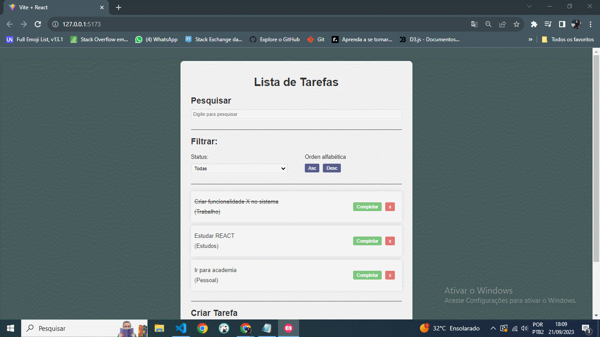

# 📝 Aplicação "To-Do List" com React: Gerencie suas Tarefas com Eficiência!

O projeto consiste na criação de uma aplicação "To-Do List" moderna e eficaz, desenvolvida utilizando a biblioteca **React**. Essa aplicação oferece uma interface intuitiva e amigável para ajudar os usuários a organizar suas tarefas diárias de forma eficiente e produtiva.

## Funcionalidades Principais:

1. **Registrar Tarefas:**
   - Os usuários podem adicionar novas tarefas de forma rápida e fácil, especificando detalhes relevantes, como título e categoria.

2. **Deletar Tarefas:**
   - Possibilidade de excluir tarefas que já foram concluídas ou que não são mais necessárias.

3. **Concluir Tarefas:**
   - Marcar as tarefas como concluídas, mantendo o controle do progresso e visualizando as metas alcançadas.

4. **Pesquisar Tarefas:**
   - Realizar buscas por palavras-chave ou frases, facilitando a localização de tarefas específicas em uma lista extensa.

5. **Filtrar Tarefas:**
   - Aplicar filtros para exibir tarefas com base em critérios selecionados, como status (completas/incompletas).

6. **Ordenar Tarefas:**
   - Ordenar as tarefas de forma alfabética ascendente ou decrecente.

Com essa aplicação, os usuários terão uma ferramenta robusta para gerenciar suas tarefas de maneira eficaz, aumentando a produtividade e facilitando a organização do dia a dia. A combinação da poderosa biblioteca **React** com um conjunto abrangente de funcionalidades torna esta aplicação uma escolha ideal para aqueles que buscam otimizar sua gestão de tarefas.

## Pré-requisitos

Visual Studio Code

## Uso
Clone o Projeto no GitHub:
https://github.com/1andersonmotta/reactTodoList
Abra o projeto com Visual Studio Code e execute: 

# Instale os pacotes de dependencia do projeto para o lado do servidor que criara o banco de dados do seu projeto:
Acessar a pasta 'server' do projeto e pelo terminal execute  
$ npm install  

# Execute a aplicação:  
$ npm start

- A Aplicação deverá subir na porta 3000 o lado do servidor com o banco de dados Sqlite.

# Instale os pacotes de dependencia do projeto agora para o lado do Cliente:
Acessar a pasta to_do_list do projeto e pelo terminal execute  
$ npm install  

# Execute a aplicação:  
$ npm run dev

- A Aplicação deverá abrir em seu navegador e estará pronta para uso.

## 🛠 Ferramentas

- [REACT](https://react.dev/)
- [NODE](https://nodejs.org/)
- [CSS](https://developer.mozilla.org/pt-BR/docs/Web/CSS)

## Contribuição

Se você tem alguma Sugestão enviar para devandersonmotta@gmail.com com o assunto: "contribuição reactTodoList" ou entre em contato pelo Linkedin.

## Licença

MIT

## ✉ Contato

email: devandersonmotta@gmail.com

linkedin: www.linkedin.com/in/anderson-motta-96b138235
---

## 💡 Objetivo

Praticar os conceitos do REACT e seus Hooks. 

